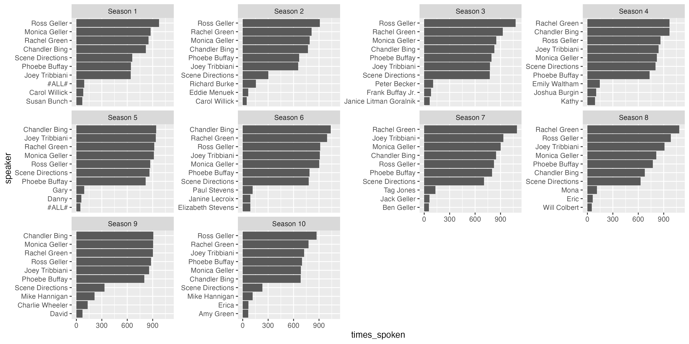

```{r setup, include=FALSE}
knitr::opts_chunk$set(echo = TRUE)
library(tidyverse)
library(flextable)
library(tidytext)
```

# Tidy Tuesday

The Tidy Tuesday project is designed to encourage R users to experiment with different ways to explore and visualise datasets.

Every week a new dataset is made available and folks share their creations on Twitter.

Datasets cover all sorts of topics:

- TV Shows

- Demographic data

- Video Games

- Political data

# Friends Week

I really enjoyed the Friends week of Tidy Tuesday, there were all sorts of visualisations shared on Twitter.

<blockquote class="twitter-tweet"><p lang="en" dir="ltr">I know it&#39;s not Tuesday, but I had some time this weekend and attempted my first contribution to <a href="https://twitter.com/hashtag/TidyTuesday?src=hash&amp;ref_src=twsrc%5Etfw">#TidyTuesday</a>. With the data including transcripts from the TV show Friends, I wanted to figure out how many times Joey (or anyone else) actually said: &quot;How you doin&#39;?&quot;. 1/4 <a href="https://t.co/o113fh82pQ">pic.twitter.com/o113fh82pQ</a></p>&mdash; Sonja Winter, PhD (@winterstat) <a href="https://twitter.com/winterstat/status/1305283132388642816?ref_src=twsrc%5Etfw">September 13, 2020</a></blockquote> <script async src="https://platform.twitter.com/widgets.js" charset="utf-8"></script>

## Exploring the dataset

We can read in the dataset directly from GitHub:

```{r message=FALSE, warning=FALSE}
library(tidyverse)
friends <- readr::read_csv('https://raw.githubusercontent.com/rfordatascience/tidytuesday/master/data/2020/2020-09-08/friends.csv')
```

There are `r length(unique(friends$speaker))` unique speakers in the dataset! Unsurprisingly the titular friends are in the top 10 (as well as scene directions)

```{r echo=FALSE}
friends %>% 
  count(speaker, sort = TRUE) %>% 
  slice_head(n = 10) %>% 
  flextable() %>% 
  set_header_labels(values = list(speaker = "Speaker",
                                  n = "Times spoken"))
```

### Season breakdown

Here's the top 10 speakers by season

```{r, eval=TRUE, echo=FALSE}
gg_season_top_10_speaker <- friends %>%
  select(speaker, season) %>% 
  group_by(season, speaker) %>% 
  mutate(times_spoken = n()) %>% 
  unique() %>% 
  group_by(season) %>% 
  slice_max(times_spoken, n = 10) %>% 
  ungroup() %>% 
  mutate(speaker = reorder_within(speaker, times_spoken, season)) %>% 
  unique() %>% 
  ggplot(aes(x = times_spoken,
             y = speaker)) +
  geom_col() +
  facet_wrap(~ season,
             scales = "free_y", labeller = as_labeller(function(x) paste("Season", x))) +
  scale_y_reordered()

ggsave("gg_season_top_10_speaker.png",
       gg_season_top_10_speaker,
       width = 12,
       height = 6)


```


